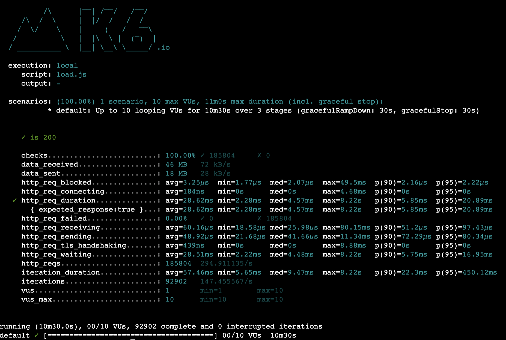
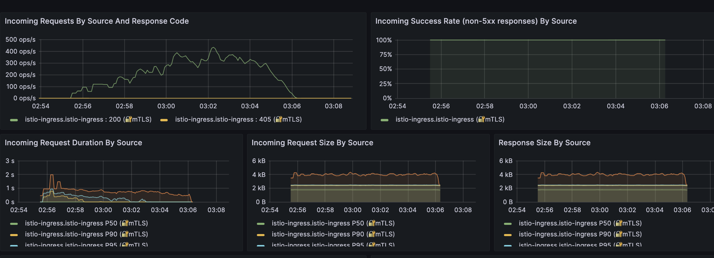

Please refer to the repo's main branch and AKS deployment for the project.

## Some key points

### 1. Pytest Scenarios

##### - test predict with truncted url
##### - test predict with list of numbers
##### - test predict with empty list
##### - test predict of caching behavior

### 2. Predict Endpoint Performance

##### Endpoint performs at 10 requests/second

### 3. Predict Endpoint Latency @ 10 Virtual Users

##### p(99) < 2 seconds
