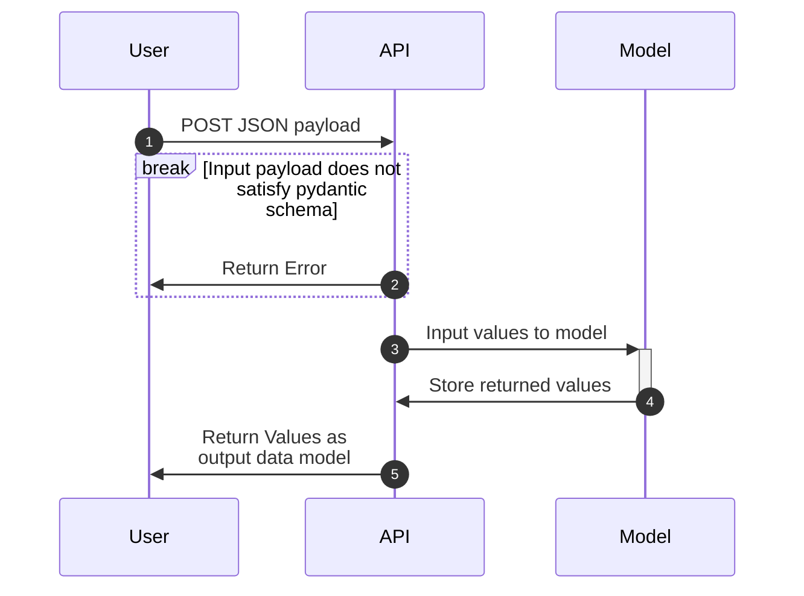

# Lab 2: Data Models and Inference

<p align="center">
    <!--SCIKIT LEARN-->
        
    <!--PLUS SIGN-->
        
    <!--FAST API-->
        
    <!--PLUS SIGN-->
        
    <!--POETRY LOGO-->
        
    <!--PLUS SIGN-->
        
    <!--DOCKER-->
        
</p>

- [Lab 2: Data Models and Inference](#lab-2-data-models-and-inference)
  - [Lab Overview](#lab-overview)
  - [Lab Objectives](#lab-objectives)
  - [Lab Setup](#lab-setup)
    - [Training Script](#training-script)
    - [Expected Final Folder Structure](#expected-final-folder-structure)
    - [Adding Poetry Dependencies](#adding-poetry-dependencies)
  - [Lab Requirements](#lab-requirements)
    - [Sequence Diagram](#sequence-diagram)
  - [Grading](#grading)
  - [Helpful Tips](#helpful-tips)
    - [How To Approach This Lab](#how-to-approach-this-lab)
    - [Dataset Background](#dataset-background)
    - [Training Script (Tips)](#training-script-tips)
    - [Inference Notes](#inference-notes)
    - [Pydantic Power](#pydantic-power)
    - [FastAPI Power](#fastapi-power)
    - [Testing Requirements](#testing-requirements)
    - [Cleaning Up Docker Images](#cleaning-up-docker-images)
    - [Mermaid Diagrams](#mermaid-diagrams)
  - [Time Expectations](#time-expectations)

---

## Lab Overview

The goal of `lab_2` is to extend your `FastAPI` application from `lab_1`. You will add an additional endpoint called `/predict` with appropriate handling for common error scenarios. You do not need to manage your submission via pull requests. We will need this as a base for `lab_3`.

We recommend reading through all [Lab Objectives](#lab-objectives) and [Helpful Tips](#helpful-tips) before starting this lab.

## Lab Objectives

1. Extend your `lab_1` application (i.e. keep all API functionality, containerization, etc. )
1. Add additional library dependencies to your application with `poetry`
1. Run the provided training script to generate a `sklearn` based ML model
1. Add a [pydantic model](https://pydantic-docs.helpmanual.io/usage/models/#basic-model-usage) to validate data inputs
1. Create a new `FastAPI` endpoint to serve predictions based off a pretrained model
1. Expand your `pytest` testing framework to account for the new functionality
1. Containerize your application with `Docker`
1. Design a bash script `run.sh` which demonstrates your application working as a containerized application
1. Document your work with a `README.md` for how to build, run, and test code in app root directory
1. Answer several short answer questions (2-5 sentences) to help solidify your understanding of this lab.

## Lab Setup

In your personal repo, copy your code from `lab_1` into a new lab folder, `lab_2`.
From this repo, copy the `trainer` directory to your new `lab_2` directory.

### Training Script

We provide the `trainer` directory which contains the necessary code to train an ML model. You do not need to modify this script. The output of the script will create a `.pkl` file for you to load in your API

We provide a `poetry` based `pyproject.toml` and `poetry.lock` which has the correct dependencies listed to run the script.

Review the [Training Script (Tips)](#training-script-tips) section for more tips.

### Expected Final Folder Structure

```{text}
.
└── .gitignore
├── lab_1
├── lab_2
|  ├── lab2
|  │   ├── Dockerfile
|  │   ├── README.md
|  │   ├── src
|  │   │   ├── __init__.py
|  │   │   ├── model_pipeline.pkl
|  │   │   └── main.py
|  │   ├── poetry.lock
|  │   ├── pyproject.toml
|  │   ├── tests
|  │   |   ├── __init__.py
|  │   |   └── test_lab2.py
|  |   └── trainer
|  |       └── train.py
|  └── run.sh
├── lab_3
├── lab_4
├── lab_5
└── project
```

### Adding Poetry Dependencies

We will ask you to add specific library version to your dependencies; This is to ensure the training version matches the solution.

Note `scikit-learn` is required even though we're only predicting in our API without any training.

**The scikit-learn version must match the version of scikit-learn used to train the model**, otherwise, you will get a warning similar to the following:

```python
UserWarning: Trying to unpickle estimator Pipeline from version 1.2.2 when using version 1.3.0. This might lead to breaking code or invalid results. Use at your own risk. For more info please refer to: https://scikit-learn.org/stable/model_persistence.html#security-maintainability-limitations`
```

## Lab Requirements

Extend your `lab_1` work with the following enhancements:

- [x] Keep all endpoints from `lab_1`

- [ ] Add `sklearn` to your `lab_2` `poetry` environment such that there are no warning/errors around versions raised. (See [Adding Poetry Dependencies](#adding-poetry-dependencies))

- [ ] Train the model using the provided script
  - You will need to train that model locally on your machine (See [Training Script](#training-script) for more details).

- [ ] Create appropriate [pydantic models](https://pydantic-docs.helpmanual.io/usage/models/#basic-model-usage) for your new prediction endpoint.
  - [ ] Create a Pydantic model for data input (request)
  - [ ] Create a Pydantic model for data output (response)
  - [ ] Add at least 1 [data validator](https://pydantic-docs.helpmanual.io/usage/validators/) based on your understanding of the dataset and what is reasonable.
  - See [Dataset Background](#dataset-background) to help define your data model

- [ ] Create a new endpoint at `/predict` that will handle `POST` requests with inputted data by returning inference results.
  - [ ] Transform and preprocess your data to a format which your `sklearn` model will be able to understand.
    - **Do not use `pandas` to preprocess your data.** `pandas` is a particularly heavy library and is unnecessary for this task; it will only create our final image size much larger due to the size of the dependency. You will get a points deduction for utilizing or including `pandas`. If you use `pandas` you will automatically receive a `50` in the lab.
  - [ ] Return the inferred results from the `sklearn` model
  - [ ] Ensure that your `/predict` endpoint leverages the pydantic models for input and returned output
    - Handle bad input, extra inputs, and non-matching types
    - If data is passed which does not meet the input schema for the model, your application should throw an error. Let the framework help you and test accordingly.
  - [ ] Ensure that your `/predict` endpoint handles a single input and a single output for the request/response cycle. Batch inputs and outputs will be part of lab 3.
  - Review [Inference Notes](#inference-notes) for more pointers.

- [ ] Create a new endpoint at `/health` that will respond to `GET` requests with the current date/time in [ISO8601 format](https://docs.python.org/3/library/datetime.html).
  - The health endpoint should return values in the format of

  ```JSON
  {"time":"2023-09-01T17:56:46.425347"}
  ```

- [ ] Utilize `pytest` to expand your existing `lab_1` test suite to now test the `lab_2` endpoints. Follow the same guidelines as with `lab_1`
  - Create a series of tests that **include but are not limited to**:
    - Test that all endpoints respond correctly to the right inputs
    - Test that all endpoints respond correctly to the incorrect inputs
    - Test the endpoints with a variety of values.
    - Any other tests which you believe will demonstrate that your API is functioning as needed

- [ ] Create a `Dockerfile` for packaging and running the application
    1. Ensure that your `Dockerfile` will build and run your `lab_2` application
    1. Extend the functionality of your `Dockerfile` by adding a `HEALTHCHECK` for the API
       - You can find [reference documentation here](https://docs.docker.com/engine/reference/builder/#healthcheck)
       - This should be polling your new `/health` endpoint
    1. Use `python:3.10-slim` for the build and application image, and the following for build dependencies. This ensures that you're not building `scipy`, `numpy`, and `scikit-learn` from source (saves time for you)

        ```Dockerfile
        RUN apt-get update \
            && apt-get install -y \
                 curl \
                 build-essential \
                 libffi-dev \
            && rm -rf /var/lib/apt/lists/*
        ```

- [ ] Create a `run.sh` file in the `lab_2` root that will do the following with descriptive `echo` statements for each step you are taking:
    1. Train the model with the training script we provided
    1. Moves model artifacts to api source directory
    1. Build your docker container (name it something useful)
    1. Run your built container in detached mode
    1. [curl](https://curl.se/) the defined endpoints from `lab_1` and `lab_2` and return status codes (same format as `lab_1` requirement)
    1. Kill the running container after the tests
    1. Clean up docker resources (See [Cleaning Up Docker Images](#cleaning-up-docker-images))

- [ ] Document your work in the `README.md` within the `lab_2/` directory
  - What your application does
  - How to build your application
  - How to run your application
  - How to test your application

- [ ] Answer the following questions in your `README.md` with 2-3 succinct sentences for each question:
    1. What does Pydantic handle for us?
    1. What do Docker `HEALTHCHECK`s do?
    1. Describe what the [Sequence Diagram](#sequence-diagram) below shows.

### Sequence Diagram



## Grading

All code will be graded off your repo's `main` branch. No additional forms or submission processes are needed.

|       **Criteria**       |         **0%**          |                                     **50%**                                     |                              **90%**                               |                              **100%**                              |
| :----------------------: | :---------------------: | :-----------------------------------------------------------------------------: | :----------------------------------------------------------------: | :----------------------------------------------------------------: |
|     *Functional API*     |    No Endpoints Work    |                            Some Endpoints Functional                            |                     Most Endpoints Functional                      |                          All Criteria Met                          |
|    *Docker Practices*    |      No Dockerfile      | Dockerfile exists but not functional or does not fit criteria (i.e. multistage) | Dockerfile fulfills most requirements but does not meet all listed |                          All Criteria Met                          |
|        *Testing*         |   No Testing is done    |          Minimal amount of testing done. No testing of new endpoints.           |          Only "happy path" tested and with minimal cases           |                          All Criteria Met                          |
|       *Run Script*       |  No Run Script exists   |            Run Script is not functional or missing key requirements             |                Run Script missing some requirements                |                          All Criteria Met                          |
|     *Documentation*      | No Documentation exists |                             Very weak documentation                             |                Documentation missing some elements                 |                          All Criteria Met                          |
| *Short-Answer Questions* | No Questions Attempted  |                          Minimal or incorrect answers                           | Mostly well thought through answers but may be missing some points | Clear and succinct answers that demonstrate understanding of topic |

---

## Helpful Tips

The following notes are non-exhaustive tips to consider when working through this lab.

### How To Approach This Lab

We have done our best to organize the requirements in the same way you should approach accomplishing the lab. If you complete each requirement in succession, you should not run into major problems. Focus on each individual task and once you feel that you have accomplished it, move on to the next section (you can use the markdown checkboxes to help keep track of your progress). **Commit early and commit often**.

### Dataset Background

We will be utilizing the [California Housing Dataset](https://scikit-learn.org/stable/datasets/real_world.html#california-housing-dataset) built into sklearn as our model.
 While you will not need to do any regression or analytics with the dataset, it will be necessary to be familiar with the input features, their types, and their outputs.
Study the provided training script we provide to get a better sense for how inputs and outputs are expected.

### Training Script (Tips)

You will not need to make any modifications to our training script, but you should understand how it is creating its values.

- What is it using to create the model?
- How does it create the model artifact?
- How can you load the created model artifact in your API?
- How can you give inputs to the created model?

### Inference Notes

- Somehow you will need to input values that are coming from your Pydantic object to the model file; how should you transform that object into something that the model can take as input?
- Since you are sending data to `/predict` it **will not** be a `GET` and instead will be `POST`.
      - You will need to write a `curl` or `requests` command to hit it effectively and send data. It might benefit you to write your tests first prior to actually hitting your `/predict` endpoint.

### Pydantic Power

- Your values should be "typed" to be reasonable for the values. Check the documentation on the dataset as your reference point.

- The names that you use for the data values are important and should be semantically sensible for both the input model and the output model (i.e. Do not use `x` as a variable name)

### FastAPI Power

- This is a great opportunity to look into the documentation of FastAPI and take advantage of things like the variety of decorators that are available to you.

- If FastAPI already handles something for you, you need not rewrite the functionality yourself if you can justify what it is doing.

- FastAPI and Pydantic have native integration which you can use to your advantage ([See Documentation](https://fastapi.tiangolo.com/tutorial/body/?h=pydantic#import-pydantics-basemodel))

### Testing Requirements

- Consider what is appropriate for you to test in your current persona (building the architecture engineer, not a data scientist)
- What if the model changes/new data is trained? Don't test the output of the model for reasonability (i.e. the predicted value is in a range that seems correct). Because models get updated/retrained, weights will shift and therefore the output range that you place in your tests will be invalid.
- Focus on the underlying mechanism of the API (when we did a prediction, did it return a result of the right type?) as opposed to the value range that it returns.

### Cleaning Up Docker Images

Docker, especially on development machines, can take up a lot of space with a variety of images, cached layers, and containers. It is good to understand the implications of this as well as how to ensure you don't overload your storage. [Check out this documentation from Docker](https://docs.docker.com/config/pruning/)

### Mermaid Diagrams

Mermaid diagrams are incredibly helpful and low barrier to entry to begin diagramming and documenting systems. You can find [helpful documentation here](https://mermaid-js.github.io/mermaid/#/sequenceDiagram).
You can interactively create diagrams utilizing the [online live editor](https://mermaid-js.github.io/mermaid-live-editor/). Mermaid diagrams are natively rendered in Github; you should copy the code block described in [Sequence Diagram](#sequence-diagram) and use this as reference.

## Time Expectations

| Previous Experience                                                                                                                | Time Estimate |
| ---------------------------------------------------------------------------------------------------------------------------------- | ------------- |
| `lab_1` is well understood, experience with `GET` vs `POST` methods, and using `pytest`                                            | 8 Hours       |
| `lab_1` went okay, but don't understand everything completely yet. Takes a while to decide the next steps even with understanding. | 20 hours      |
| Struggled with `lab_1` and have trouble writing tests with `pytest` or new endpoints in `FastAPI`                                  | 30 hours      |
