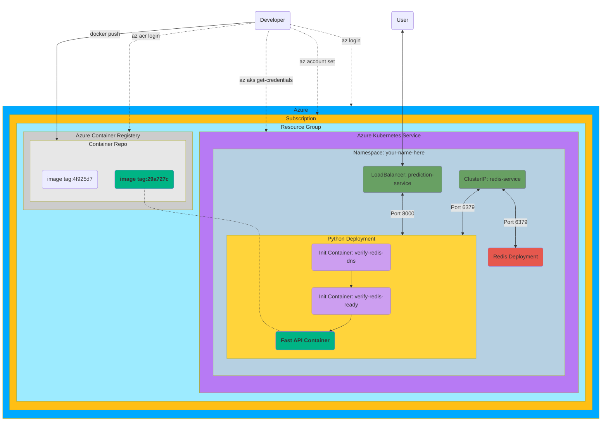

# Lab 4: Deploying Kubernetes to the Cloud

<p align="center">
    <!--FAST API-->
        
    <!--PLUS SIGN-->
        
    <!--REDIS LOGO-->
        
    <!--PLUS SIGN-->
        
    <!--KUBERNETES-->
        
    <!--PLUS SIGN-->
        
    <!--Azure-->
        
</p>

- [Lab 4: Deploying Kubernetes to the Cloud](#lab-4-deploying-kubernetes-to-the-cloud)
  - [Lab Overview](#lab-overview)
  - [Lab Setup](#lab-setup)
  - [Lab Objectives](#lab-objectives)
    - [Deployment Requirements](#deployment-requirements)
    - [Documentation Requirements](#documentation-requirements)
  - [Submission](#submission)
  - [Grading](#grading)
  - [Time Expectations](#time-expectations)
  - [Helpful Tips](#helpful-tips)
    - [How to approach this lab](#how-to-approach-this-lab)
    - [Understanding the Cloud Landscape](#understanding-the-cloud-landscape)
    - [Useful Commands](#useful-commands)
      - [Hitting `/bulk_predict` API endpoint](#hitting-bulk_predict-api-endpoint)
      - [Using non-`latest` tags for production deployment](#using-non-latest-tags-for-production-deployment)
      - [Generate and apply kustomize files](#generate-and-apply-kustomize-files)
      - [Various `Istio`/`Cert-Manager`/`External-DNS` lookups](#various-istiocert-managerexternal-dns-lookups)
      - [Miscellaneous commands](#miscellaneous-commands)
    - [Developing on Apple Silicon](#developing-on-apple-silicon)
    - [Links](#links)

## Lab Overview

The goal of `lab_4` is to deploy your application to an online cloud provider as well as:

- Use [Kustomize](https://kustomize.io/) to enable a consistent approch to deploying between `Minikube` and `Azure Kubernetes Service (AKS)`
- Properly tag your aplication image with best practice in mind.
- Push your API image to `Azure Container Registry (ACR)` to enable deploying your application in a secure way to a production cluster
- Deploy your application to `AKS` using `istio` and `kustomize`
  - In your local environment you __will not__ use  `istio` (this is why we use `kustomize`)

Additionally the following have been handled for you automatically:

- DNS (`{namespace}.mids255.com` using `external-dns`)
- TLS Cert (Let's encrypt certs generated using `cert-manager`)
- HTTP -> HTTPS redirection `istio-gateway`
- Istio Gateway for DNS `istio-gateway`

No changes to your FastAPI/past application will be required for this lab, this is solely about deploying your application to the cloud.

## Lab Setup

- [x] Copy your code from lab 3 into a new lab folder `lab_4`. You will use the same model you trained in `lab_4`
- [ ] Install Azure CLI on your local machine, `az` (<https://docs.microsoft.com/en-us/cli/azure/install-azure-cli>)
- [ ] Setup your Azure Account
  - You should have received an email to your berkeley email account inviting you
  - If you do not have access, please notify an instructor in the appropriate Slack channel.
- [ ] Utilize the following commands to setup your local system to work with our Azure account
  - [ ] Authenticate to Azure with your `@berkeley.edu`
    - `az login --tenant berkeleydatasciw255.onmicrosoft.com`
  - [ ] Set Subscription to the one for the class
    - `az account set --subscription="[SUBSCRIPTION_ID]"`
    - Get ID from README.md in the root of the `main` repo
  - [ ] Authenticate to the `AKS` cluster
    - `az aks get-credentials --name w255-aks --resource-group w255 --overwrite-existing`
  - [ ] Change your kubernetes context between the `AKS` cluster and `minikube`
    - `kubectl config use-context minikube`
    - `kubectl config use-context w255-aks`
  - [ ] Login to `ACR` repository
    - `az acr login --name w255mids`
- [ ] Get your kubernetes namespace prefix referred to as `$NAMESPACE` or `$IMAGE_PREFIX`
  - DNS Normalized form of your `@berkeley.edu` email address, DNS does not allow for `_` or `.`
  - Change `_` to `-` and remove all `.`
    - `winegarj@berkeley.edu` -> `winegarj`
    - `test_123.4@berkeley.edu` -> `test-1234`

## Lab Objectives

### Deployment Requirements

- [ ] Create a `.k8s` directory in your `lab_4` folder
  - [ ] Create subdirectories for `bases`, `dev`, `prod`
  - [ ] Copy the available stubs in this directory
  - [ ] Modify to work within your namespace
    - You will change your namespace from `w255` which you were deploying to locally to the normalized form of your `@berkeley.edu`
- [ ] Modify the stubs to allow for local development
- [ ] Review the stubs for production and make any changes required
  - A `VirtualService` will be required for `AKS`. Review [this documentation from istio about how a Virtual Service works](https://istio.io/latest/docs/reference/config/networking/virtual-service/)
- [ ] Push your image to a namespaced location in `ACR`
  - The tag for your image should be the "short" hash of the last commit you have made before pushing your image
    - Example: `w255mids.azurecr.io/winegarj/lab4:ae2e838`
    - It's good practice to commit your code before building the image. By then using the short git hash, you can then cross reference your built image to the code that you have committed in your repo.
    - Build this as a bash script that will get the short commit hash from the git CLI and then save that variable to then be used in your image build and then properly tag and push your image to the registry.
  - [Check out this tutorial from Microsoft on deploying things to `AKS` from `ACR`](https://learn.microsoft.com/en-us/azure/aks/tutorial-kubernetes-deploy-application?tabs=azure-cli)
- [ ] Deploy your application in `AKS`
- [ ] Be able to get a prediction from your API in `AKS`
  - You will automatically be able to access your API at `$NAMESPACE.mids255.com/{predict,health,bulk_predict}` if you configured everything appropriatly.
  - This is based on the `VirtualService` defined.

### Documentation Requirements

- [ ] Create a `README.md` for how to deploy your application
- [ ] An example curl request we can use to test against the `$NAMESPACE.mids255.com/predict` and `$NAMESPACE.mids255.com/bulk_predict` endpoints that meets your request model in your API
- [ ] Answer the following questions:
    1. What are the downsides of using `latest` as your docker image tag?
    1. What does `kustomize` do for us?

## Submission

All code will be graded off your deployment in Azure. You do not need to create a `run.sh` script to automate your deployment.

## Grading

Grades will be given based on the following:

|       __Criteria__        |             __0%__             |                            __50%__                            |                               __90%__                               |                              __100%__                               |
|:------------------------: |:-----------------------------: |:------------------------------------------------------------: |:------------------------------------------------------------------: |:------------------------------------------------------------------: |
|         _Functional API_  | No Endpoints Work              | Some Endpoints Functional                                     | Most Endpoints Functional                                           | All Criteria Met                                                    |
|  _Kubernetes Deployment_  | Deployment not in Cloud        | Deployments exist but lack key functionality                  | Kubernetes deployment mostly functional                             | All Criteria Met                                                    |
|           _Docker Image_  | No Docker Image pushed to ACR  | Docker Image uses latest tag only                             | Docker Image uses hardcoded tag                                     | Docker Image uses correct tag and is automated                      |
|          _Documentation_  | No Documentation exists        | Very weak documentation                                       | Documentation missing some elements                                 | All Criteria Met                                                    |
| _Short-Answer Questions_  | No Questions Attempted         | Minimal or incorrect answers                                  | Mostly well thought through answers but may be missing some points  | Clear and succinct answers that demonstrate understanding of topic  |

## Time Expectations

This lab will take approximately ~10-20 hours. Most of the time will be spent configuring `kustomize` and reviewing the `istio` processes.

---

## Helpful Tips

### How to approach this lab

We have done our best to organize this lab in a top-down fashion to best direct your order of operations.

### Understanding the Cloud Landscape

Consider the following visualization of the different azure services and how the commands described in [Lab Setup](#lab-setup).



### Useful Commands

#### Hitting `/bulk_predict` API endpoint

```bash
NAMESPACE=winegarj
curl -X 'POST' 'https://${NAMESPACE}.mids255.com/bulk_predict' -L -H 'Content-Type: application/json' -d '{"houses": [{ "MedInc": 8.3252, "HouseAge": 42, "AveRooms": 6.98, "AveBedrms": 1.02, "Population": 322, "AveOccup": 2.55, "Latitude": 37.88, "Longitude": -122.23 }]}'
```

#### Using non-`latest` tags for production deployment

Consider the following bash code-snippet for your `build-push.sh` script. examine each line and see if you can make sense of what we are doing.

```bash
TAG=$(some way to generate strings)
sed "s/\[TAG\]/${TAG}/g" .k8s/overlays/prod/patch-deployment-lab4_copy.yaml > .k8s/overlays/prod/patch-deployment-lab4.yaml
```

#### Generate and apply kustomize files

```bash
kubectl kustomize .k8s/overlays/dev
kubectl apply -k .k8s/overlays/dev
```

#### Various `Istio`/`Cert-Manager`/`External-DNS` lookups

```bash
kubectl --namespace externaldns logs -l "app.kubernetes.io/name=external-dns,app.kubernetes.io/instance=external-dns"
kubectl --namespace istio-ingress get certificates ${NAMESPACE}-cert
kubectl --namespace istio-ingress get certificaterequests
kubectl --namespace istio-ingress get gateways ${NAMESPACE}-gateway
```

#### Miscellaneous commands

```bash
# Image prefix is a DNS-compliant version of your berkeley email address
# DNS does not allow for _ or .
# Change _ to - and remove all . if you want to manually write IMAGE_PREFIX
# Example: winegarj@berkeley.edu -> winegarj
# Example: test_123.4@berkeley.edu -> test-1234
# IMAGE_PREFIX=winegarj
IMAGE_PREFIX=$(az account list --all | jq '.[].user.name' | grep -i berkeley.edu | awk -F@ '{print $1}' | tr -d '"' | tr -d "." | tr '[:upper:]' '[:lower:]' | tr '_' '-' | uniq)

# FQDN = Fully-Qualified Domain Name
IMAGE_NAME=lab4
ACR_DOMAIN=w255mids.azurecr.io
IMAGE_FQDN="${ACR_DOMAIN}/${IMAGE_PREFIX}/${IMAGE_NAME}"

az acr login --name w255mids

docker tag ${IMAGE_NAME} ${IMAGE_FQDN}
docker push ${IMAGE_FQDN}
docker pull ${IMAGE_FQDN}
```

### Developing on Apple Silicon

Even though we are building our codebase as docker images, it is important that the images align in their underlying architecture of the machine it will be running on. Images that are built _on_ an Apple Silicon device will have their CPU architecture designed _for_ Apple Silicon. The kubernetes cluster that we are using in Azure _is not_ Apple Silicon architecture. __This means that you will run into issues running your natively built images unless you specify the correct architecture if you are building on a different architecture than what you are deploying on.__ To remedy this, you must specify the architecture in the build command:

```bash
docker build --platform linux/amd64 -t ${IMAGE_NAME}:${TAG} .
```

As noted previously, you may want to consider creating a build-push script which will simplify your life so that it will automatically apply these features to your process (hint: this could be integrated into some automatic CI/CD build pipeline in your future work)

### Links

Azure Subscription ID: tbd

- ACR
  - <http://w255mids.azurecr.io/>
  - <https://portal.azure.com/#@berkeleydatasciw255.onmicrosoft.com/resource/subscriptions/0257ef73-2cbf-424a-af32-f3d41524e705/resourceGroups/w255/providers/Microsoft.ContainerRegistry/registries/w255mids/overview>
- AKS
  - Namespaces
    - <https://portal.azure.com/#@berkeleydatasciw255.onmicrosoft.com/resource/subscriptions/0257ef73-2cbf-424a-af32-f3d41524e705/resourceGroups/w255/providers/Microsoft.ContainerService/managedClusters/w255-aks/namespaces>
  - Workloads/Deployments:
    - <https://portal.azure.com/#@berkeleydatasciw255.onmicrosoft.com/resource/subscriptions[…]icrosoft.ContainerService/managedClusters/w255-aks/workloads>
  - Services:
    - <https://portal.azure.com/#@berkeleydatasciw255.onmicrosoft.com/resource/subscriptions[…]ntainerService/managedClusters/w255-aks/servicesAndIngresses>
- Azure DNS
  - <https://portal.azure.com/#@berkeleydatasciw255.onmicrosoft.com/resource/subscriptions[…]55/providers/Microsoft.Network/dnszones/mids255.com/overview>
